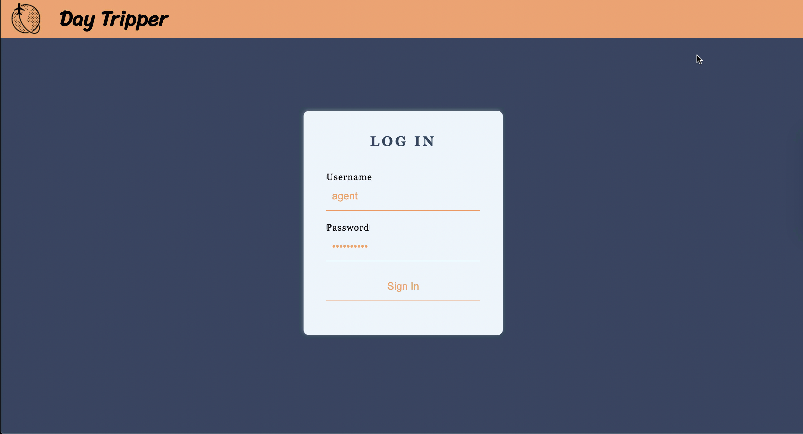
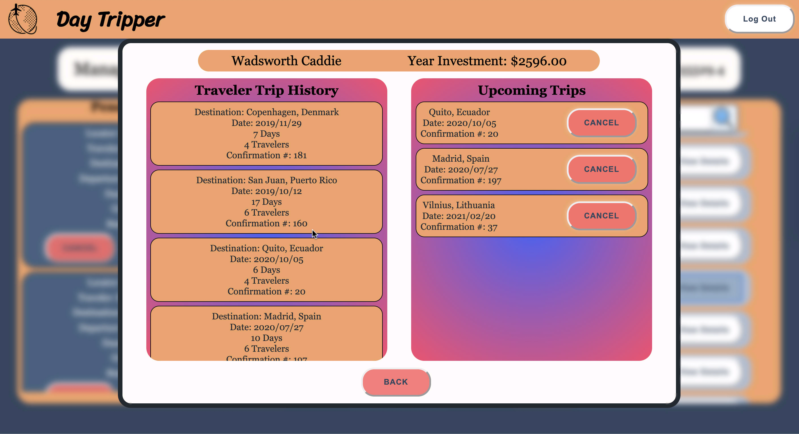
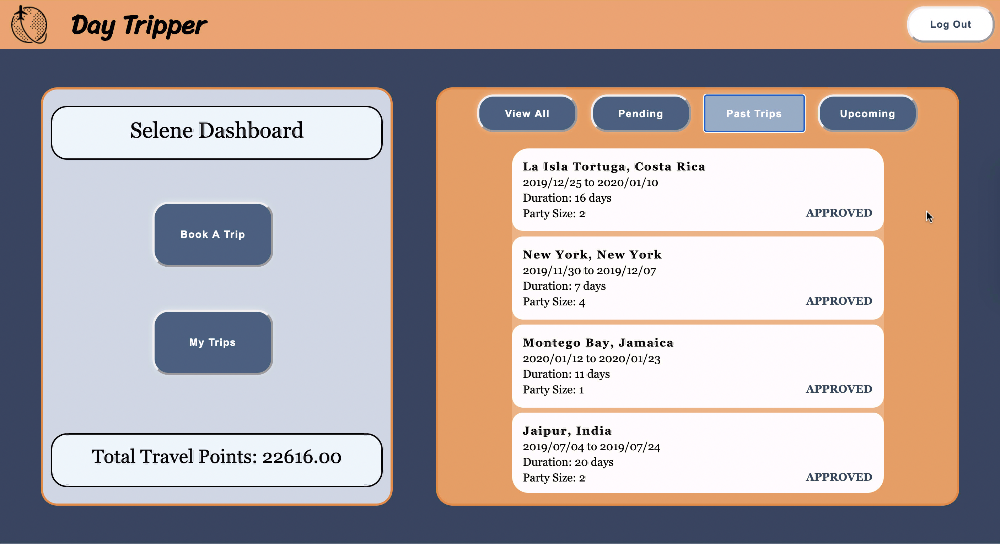
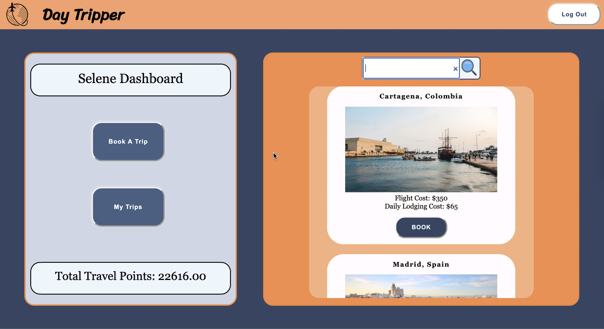
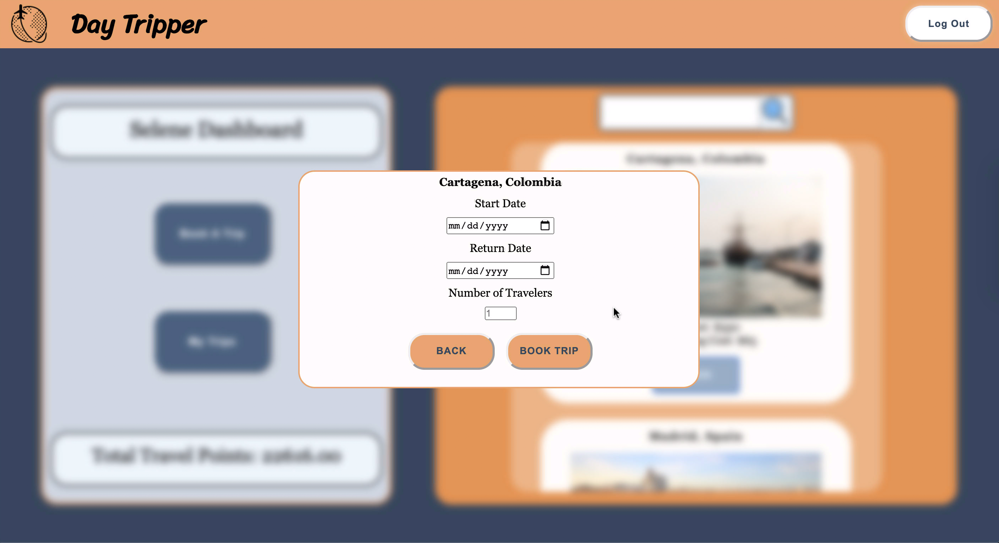

# Travel Tracker Project 

## Abstract for Day Tripper

Final solo project for Module 2 of Turing School of Software Development and Design. It focused on Test Driven Development, Object Oriented Development, and implementing the Fetch API for accessing data. This application was built to allow both a User and Travel Agent Dashboard. The user is able to book a trip and see the amount they have invested on travels with the company. The Travel Agent is able to approve or deny any pending travel request made by the user. Travel Agent is also able to cancel a future trip. 

## Sample Images 






## Installation Steps
```
- clone the repo
```
```
- run npm install 
```
```
- run npm start
```
```
- go to http://localhost:8080/ to view the running application. 
```
```
Enter `control + c` in the terminal to stop the server
```

### Technologies

- HTML/CSS
- JavaScript
- JQuery
- Scss
- Webpack
- Mocha
- Chai
- Fetch API
